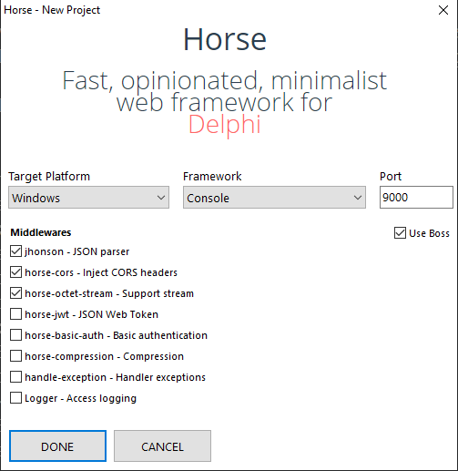

# Horse Wizard

<b>Horse-wizard</b> is a wizard for creating new [Horse](https://github.com/HashLoad/horse) applications. Easy, fast and simple. A tool to make your work easier!
 We created a channel on Telegram for questions and support:  

## ✔️ Compatibility
This Wizard is compatible with projects developed in:
- [X] Delphi
- [ ] Lazarus

## ⚙️ Demo and Installation

## Wizard

## ⚡️ Horse Project
The Horse Project option is to create a new project using horse and its official middlewares. The project can be created for both Windows (Apache, CGI, Console, IIS, VCL and WinService) and Linux (Apache, Console and Daemon) platforms.

## ⚡️ Horse Controller
The Horse Controller option is to create a new Controller where you can map your routes for each respective Verb.

## ⚠️ License
`Horse-Wizard` is free and open-source middleware licensed under the [MIT License](https://github.com/HashLoad/horse-wizard/blob/master/LICENSE). 
